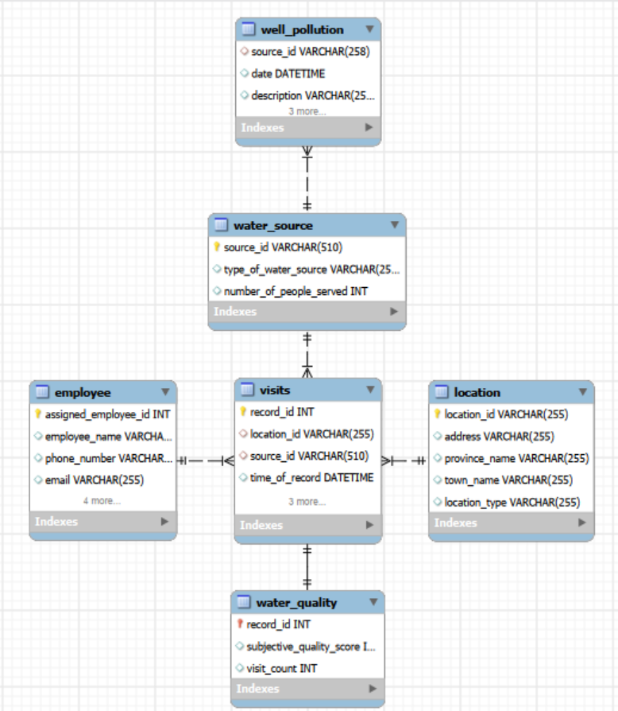
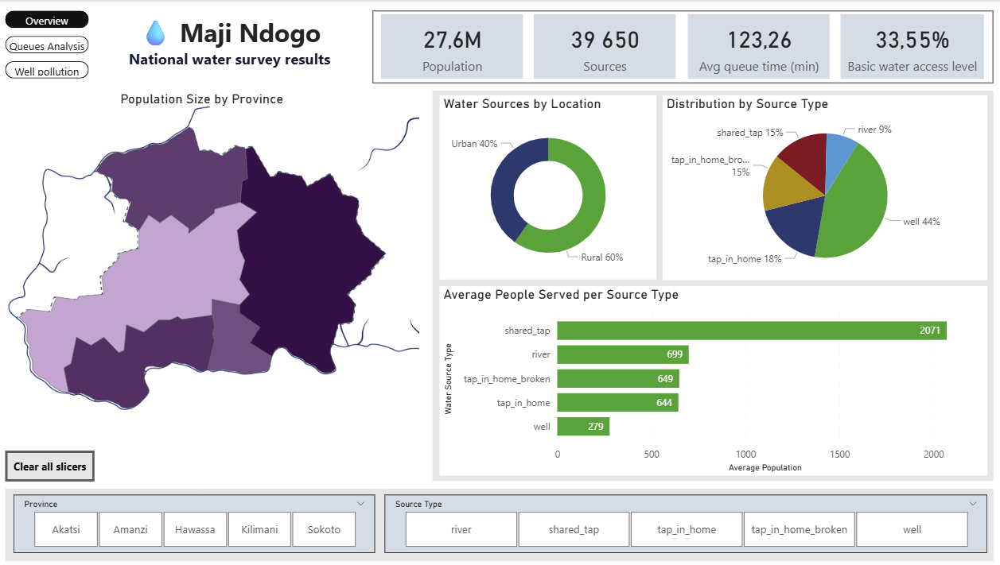
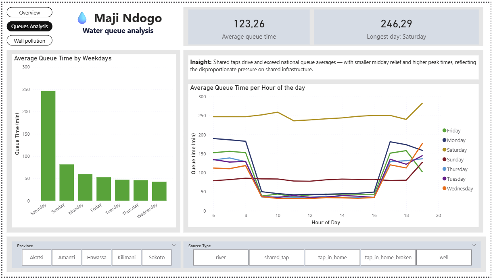
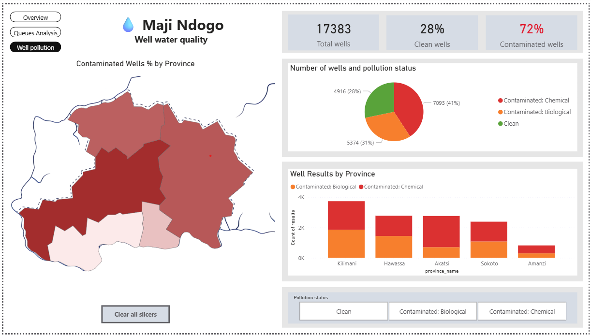
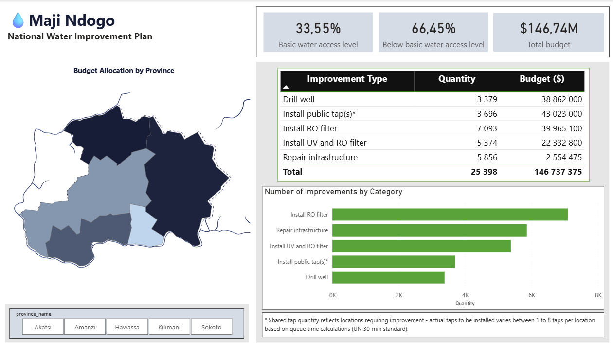
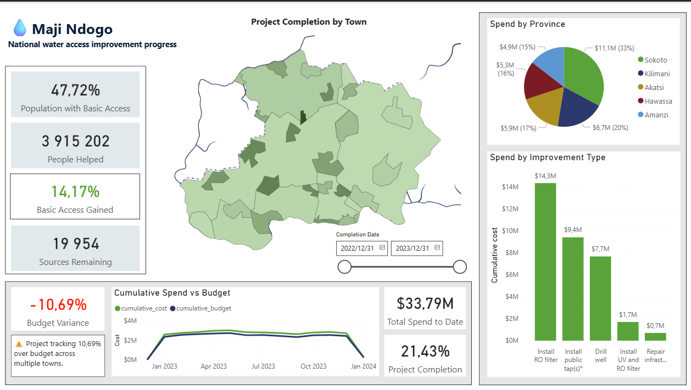
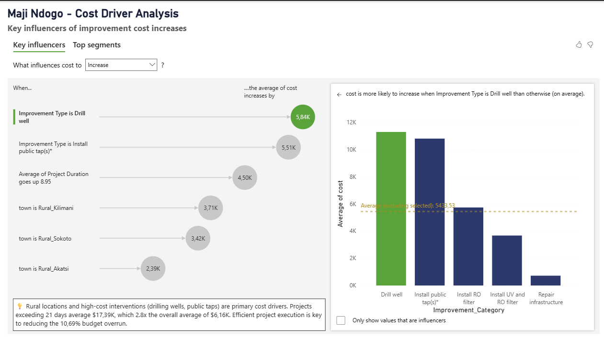

# 💧 Maji Ndogo Water Crisis Analysis

## Project Overview
End-to-end data analysis of a severe water access 
crisis in Maji Ndogo - a fictitious country facing 
critical water infrastructure challenges affecting 
27.6 million people across 5 provinces.

As part of a diverse analytical team, I was tasked 
with analysing 60,000 water access survey records 
to inform the new government's water restoration 
decisions and prioritise infrastructure investments.

## Problem Statement
Maji Ndogo's water infrastructure has been left in 
ruins following years of mismanagement and 
corruption. Citizens queue an average of 123 minutes 
daily for water. The government needs data to:
- Understand the current state of water access
- Identify high-risk sources and priority areas
- Plan and budget restoration interventions
- Track progress of improvement programme

## Tools & Skills
| Tool | Application |
|---|---|
| MySQL | Data cleaning, EDA, analysis, normalisation |
| Power BI (DAX) | Interactive dashboards, measures, KPI tracking |
| Power Query | Data transformation and loading |
| GitHub | Version control and portfolio documentation |

## Project Structure
📁 maji-ndogo-water-crisis-analysis/
├── 📁 sql/
│     └── maji_ndogo_analysis.sql
├── 📁 powerbi-dashboard/
│     └── 📁 screenshots/
├── 📁 data/
│     └── infrastructure_costs.xlsx
├── 📁 data_model/
│     └── data_model.png
└── 📄 README.md

## Data Model
Star schema generated from MySQL database schema. 
visits table as central fact table with dimension tables 
for location, water sources and employees.

## SQL Script Structure
The SQL script (669 lines) is structured as 6
documented chapters with consistent commenting
and findings summaries throughout:

- **Chapter 1** - Database & table setup
- **Chapter 2** - Exploratory data analysis (EDA)
- **Chapter 3** - Data cleaning & integrity fixes
- **Chapter 4** - Analysis & insights
- **Chapter 5** - Deeper analysis — provincial breakdown
- **Chapter 6** - Progress tracking table

## Key Insights
1. 60% of water sources are in rural areas
2. 43% of the population rely on shared taps - 
   averaging 2,000 people per tap
3. 31% have home water infrastructure - 45% of 
   which is non-functional
4. 18% rely on wells - only 28% are clean
5. Average queue time of 123 minutes per water 
   collection trip - peaking at 246 minutes on Saturdays
6. 25,398 improvement assignments generated 
   across 5 provinces - total budget R146.74M
7. At 21% project completion, basic water access 
   improved from 33.55% to 47.72% - 
   a 14.17 percentage point increase

## Dashboard
**Report 1 - National Survey Results**

**Report 2 - National Water Improvement**

## Data Sources
- Water access survey data provided via ALX Africa 
  Data Analysis programme (60,000 records across 
  39,650 water sources)
- Infrastructure costs: included in /data folder
- Dataset covers 5 provinces and all location types 
  (urban/rural)
- Note: Maji Ndogo is a fictitious country - 
  data privacy principles applied throughout

## Author
**Judy Madonsela | Eligible to register as CA(SA) | Data Analyst**

Data analyst with Big Four external audit experience 
(KPMG). This project demonstrates end-to-end data 
analysis skills - from raw data through to 
decision-ready government dashboards - applied to 
a real-world water access crisis.

📧 madonsela.judys@gmail.com | 💼 https://www.linkedin.com/in/judy-madonsela/ | 🐙 https://github.com/JudyMadonsela
